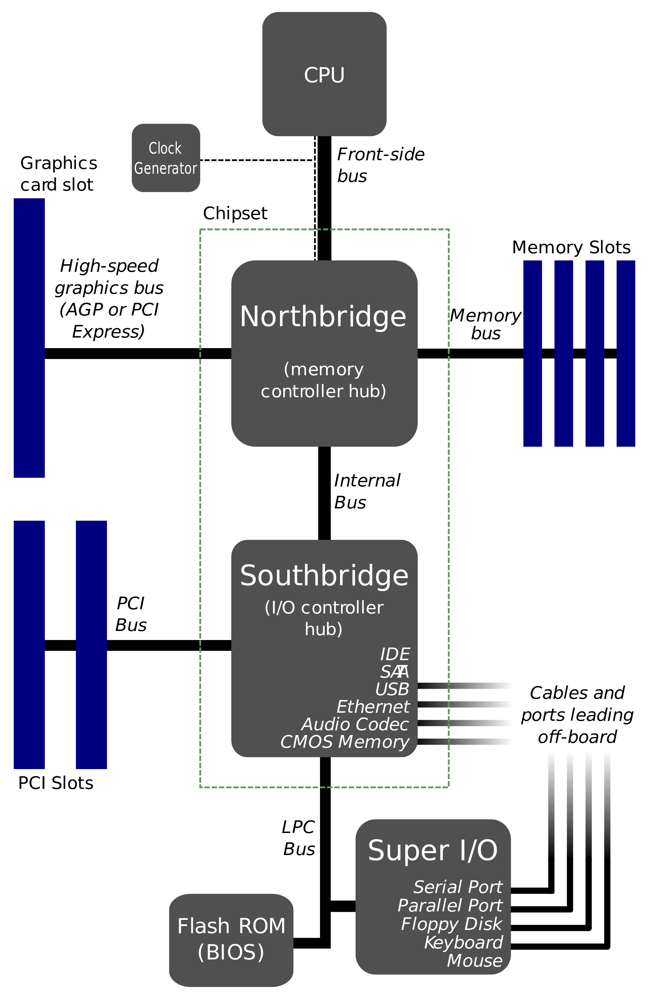

# 2 Baby Steps ve GNU/Linux İşletim Sisteminin Yapısı
## 1. Kabuk Kavramı                                                             (PFE101 Unite2 P:13)
    - İşletim sistemi çekirdeği ile kullanıcının daha rahat bir şekilde iletişim kurmasını sağlayan bir birimdir kabuk. Çoğu GNU/Linux dağıtımlarında BASH kabuğu varsayılan olarak gelmektedir. 4. Ünitede detaylı şekilde haşır neşir olacağız ancak şimdilik bilmeniz gerekn kısım şudur; kullanıcının işlettireceği komutları, çalıştırılacak programları arkaplanda kabuğa iletip, karşılığını ekrana kullanıcının karşısına getiren bir araçtır. Varsayılan olarak gelen BASH yerinde sistemde sh kabuğu da bulunmatkadır. Dilerseniz daha sonra da ekleyebiliyorsunuz, örnek olarak beni şuanda kullandığım zsh'ı verebiliriz. Fish çok kullanılan kabuklardan birisidir. 

## 2. Yardım Almak (man, info, help, Google :P)                                 (PFE101 Unite8)

## 3. Kabukta İlk Adımlar (whoami, pwd, cd, ls, cat)
        - 3.1 Seçenekler, çift ve tek tire
            . Her programın kendi içerisinde seçenekleri, özellikleri, mevcuttur. Bütün bunları ezbere bilmeniz gerekmez, örnek olarak önünüzde açık olan terminaller üzerinde yazacağınız bir help komutu, help programını çalıştırıp sizin önünüze sık kullanılan programları ve nasıl kullanıldığını getirmektedir. Bu help BASH'ın bir özelliği olarak gelmektedir.

        - 3.2 Parametre ve argümanlar
            . Parametre ile argüman arasında fark vardır. C/C++ dilinden örnek verecek olrusak;
                int toplayici(int a, int b)
                {
                    return a + b;
                }

                cout >> toplayici(5,4) >> endl;
            
            . Fonksiyonun içerisindeki a ve b değişkenleri parametre, aşağıda kullanılan toplayıcı(5,4) içerisindeki 5 ve 4 sayıları o fonksyiona parametre olarak gönderilecek argümanlardır. Peki size sorum şu biz `cd /home/cargamoni` komutunu yazarken neresi parametre neresi neresi argüman.

## 4. Açılış Sistemi                                                            (PFE101 Unite 2)
    - Bilgisayar nasıl açılır ? Adım adım anlatılacak.

## 5. Dosya Sistemlerinin Tanıtılması                                           (PFE101 Unite 6 P:44.45.46)
    - GNU/Linux işletim sisteminde herşey dosyadır. Bu yüzden dosya sistemi önemlidir. Bir değineceğiz. Tiplerine bakacğız neler var neler yok bunlardan bahsedeceğiz. Detaylı olarak 09 Depolama aygıtlarının yönetiminde işleyeceğiz.

## 6. Dosya ve Dizin Hiyerarşisi                                                (PFE101 Unite 2 P:12)
    . `ls -l /`
        - /boot dizininde linux açılışına dair veriler örneğin initrd, vmlinuz bulunur.
        - /etc dizininde tüm konfigürasyon dosyaları bulunur.
        - /home kullanıcıların ev dizinlerinin bulunduğu ana dizindir.
        - /dev linux sistemdeki device ların bulunduğu dizindir.
        - /tmp ortak yazma alanıdır. her kullanıcı yazabilir ancak kimse kimsenin dosyasını silemez.
        - /proc sistemle ilgili istatistiki bilgilerin sorugalanabildiği dizindir. (örnek cat
        - /proc/cpuinfo)
        - /var dzininde ağırlıklı olarak kütüphaneler bulunur
        - /bin dizininde temel komutlar bulunmaktadır.

## 7. Dosya Türleri (Dizin, Soket, vs)
    - : regular file, standart dosya
    d : directory, dizin
    c : character device file, karakter birimi dosyası
    b : block device file, blok birim dosyası, depolama birimleri
    s : local socket file, lokal soket dosyası
    p : named pipe, borulama dosyası,
    l : symbolic link, sembolik link dosyası
    D : Door file (Solaris), kapı dosyaları
    
    c: Karakter birim dosyaları. İlk duyulduğunda akılda bir şey canlanmıyor değil mi ? Aslında karşınızda açık. Karşınızda gördüğünüz terminal bir karakter birimi dosyasının çalıştırılacak karşınızda yer almış halidir. Karakter birim dosyaları, aktif olarak seri yayın yapan donanımdan gelen çıktıyı önünüze seren birimlerdir. Örnek olarak ctrl+alt+f2 ile bir başka terminalde giriş yaparak `echo hebede > tty2` komutunu çalıştırarak pekiştirebilirsin.

    s: Soket dosyaları, interprocess communication dediğimiz bir kavramı sağlamak için kullanılırlar. Interprocess Communication Türkçesinden de anlaşılacağı gibi Süreçler Arası İletişimdir. Bu süreçler arası iletişimde soket dosyaları iş görürler.

    p: Borulama dosyası, soket dosyaları aynı şekilde interprocess communication için kullanılan dosyalardır. Bir sürecin çıktısını bir başka process'e eklemektedir. `mkfifo` incelenebilir (ileri seviye).

    D: Kapı dosyaları Solaris sistemlerinde kullanılan Client-Server arası interprocess communication için kullanılan dosyalardır. Ben daha kullanmadım, görmedim, bilmiyorum nasıl birşeydir.

## 8. Sembolik bağ tanım                                                            
    - Ne olduğunu anlatacağız nasıl birşey olduğu, kullanımını değil.

## 9. Mutlak Yol, Bağıl Yol Kavramları                                          
    - Adreslerden .. lardan, yol tariflerinden örnekler vere vere kafada oturmasına yardımcı olacak şekilde anlatılacak.