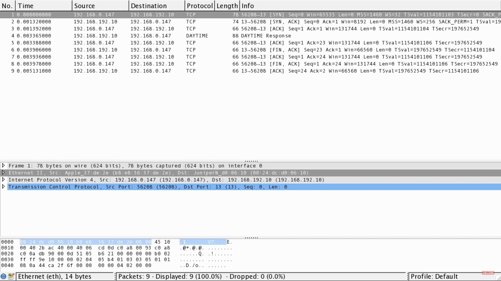
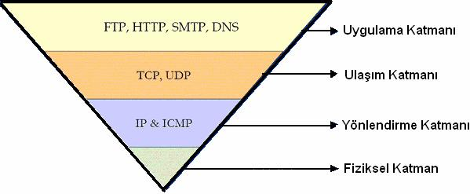

# 11 Temel TCP/IP Bilgisi ve Ağ Yönetimi

# 1. Ağ Nedir?

- Ağ, iki veya daha fazla bilgisayarın kablolu ya da kablosuz iletişim araçları üzerinden yazılım ve donanım bileşenleri ile birlikte bağlanarak meydana getirilen sistem olarak tanımlanabilir.  

### 2. Temel Ağ Bilgisi

##### Ağların Gelişimi ve Ağ Teknolojileri 

- Ana Makine (MainFrame) Modeli: Ağ kavramı ilk olarak Ana Makine (MainFrame) teknolojisi ile ortaya çıkmıştır. Ana makinenin kendi işlemcisi (CPU), sabit diski (harddisk), ve bunları kumanda etmek için bir ekranı ve klavyesi ve de terminallere bağlı seri portları vardı. Bu aptal terminaller (dumb terminal) sadece ekran ve klavyeden oluşurdu, yani bir deyişle pasif makinelerdi. Terminallerin yerel bir disk alanları da olmadığı için bilgiyi ana makine üzerinde saklarlardı. Tüm yük anamakinenin üzerindeydi ve bu yüzden çok pahalıydı. En büyük dezavantajı tabii ki güvenilir olmaması, yani ana makinede çıkacak bir sorunun tüm sistemi etkilemesi, terminallerin kendi başlarına işlem yapabilme kaabiliyetlerinin olmaması idi. Bu önemli sorunhalen çok popüler olan İstemci/Sunucu (Client/Server) modelinin doğmasına yol açtı.  

- İstemci / Sunucu (Client/ Server) Modeli: İstemci/Sunucu modeli ile pasif terminaller yerine kendi başlarına işlemler yapabilen ve kendi sabit disklerinde programlar saklayabilen makineler geldi. Böylece her istemci kendi başlarına belirli işlemleri yerine getirebilmekte, yetersiz durumda kaldıklarında ise o işe özelleşmiş olan sunuculara başvurmakta idiler. Örneğin her istemcide ofis uygulamaları, masa üstü yayıncılık, oyun programları kullanılması buna rağmen veri tabanı ya da web gibi uygulamalarda bir sunucuya erişilmesi gibi.  

- Eşlenik Ağ (Peer to Peer) Modeli: İstemci/Sunucu modelinin gelişmesi ve yaygınlaşması ile birlikte istemcilerin daha ön plana çıktığı, özelleşmişsunuculara ihtiyaç duyulmayan ağ örnekleri de ortaya çıkmaya başladı. Bu ağlarda makineler yaklaşık özelliklerde idi ve işleyiş olarak birbirlerine üstünlük sağlamıyorlardı.

##### Ağ Çalışma Prensipleri 

- Temel olarak ağlarda iki tip çalışma prensibi vardır:  

1. Yayın (Broadcast): Ağa atılan bir paketin her bilgisayara gönderilmesi. 

2. Noktadan noktaya (Point to Point): Ağa atılan bir paketin özel bir noktaya iletilmesi.  Ağların çalışma prensipi genelde yayın tarzındadır. Buna rağmen İnternet omurgası noktadan noktaya çalışmaktadır. 

##### Büyüklüklerine Göre Ağlar 

- LAN (Local Area Network) Yerel Alan Ağı: Kurulabilecek en küçük çaplı ağ olmakla birlikte büyüklükleri bir oda veya bir binayla sınırlı kalmayıp 1 km'ye kadar çıkabilmektedir. Örneğin küçük ve orta dereceli kurumların ağları.  

- WAN (Wide Area Network) Geniş Alan Ağı: Aralarında 1 km'den fazla mesafe olan LAN ların birleşmeleriyle meydana gelirler. Türkiye'deki en meşhur WAN'lardan biri Turnet (Türkiye iç omurgası), bir diğeri Ulaknet'tir (Üniversiteler arası ağ).  

- MAN (Metropolitan Area Network) Metropol Alan Ağı: WAN'ların şehir bazında ya da şehirler arası birleştirilmeleriyle oluşur, fakat günümüzde MAN kavramı kullanılmamakta, yerine WAN terimi tercih edilmektedir

#### 2.1. OSI Katmanları

Her teknojik üründe olduğu gibi ağlarda da standartları belirleyen bir kuruluş vardır. Bu kurum ISO (International Standards Organization) olarak bilinir ve ağ haberleşmesinde 7 katmandan oluşan OSI (Open System Interconnection) açık sistemler arası bağlantı kurallarını belirlemiştir. Bir ağ oluşturmak için fiziksel gereksinimlerin dışında, cihazların haberleşebilmeleri için ortak bir anlaşma biçimine yani bir takım protokollere ihtiyaç duyulur. Her protokolün çalıştığı katman yaptığı işe göre değişmektedir. Bu bahsedilen katmanlar şu şekilde sıralanmaktadır

    7 Uygulama / Application  
    6 Sunum / Presentation  
    5 Oturum / Session 
    4 Taşıma / Transport 
    3 Ağ / Network 
    2 Veri iletim / Data Link 
    1 Fiziksel / Physical  
 
 - Uygulama katmanı kullanıcıya en yakın olan ve programla iletişimini sağlayan katman, fiziksel katman ise en uzak olan ve kablodaki veri transferini içeren katmandır. Bir veri demeti, programın uygulama katmanından fiziksel katmana kadar çeşitli işlemlerden geçip (enkapsüle edilip), kablo üzerinden ağa ve oradan da diğer bilgisayarlara ulaşıp tam tersi işleme tabi tutularak, uygulama katmanına çıkarak diğer kullanıcılara iletilir. İnternette ve ağ uygulamalarında yaygın olarak kullanılan TCP/IP protokolünün uygulanmasında ise 6 ve 5 numaralı katmanlar uygulama katmanının içine dahil edilir ve sonuç olarak ortaya melez (hybrid) bir yapı ortaya çıkar.

        TCP / IP Modeli:  				Melez (Hybrid) Model (OSI & TCP/IP)
        7 Uygulama / Application        

		                                5 Uygulama / Application
        4 Taşıma / Transport            4 Taşıma / Transport  
        3 Ağ / Network                  3 Ağ / Network
        2 Veri iletim / Data Link       2 Veri iletim / Data Link
        1 Fiziksel / Physical           1 Fiziksel / Physical
 
- Ortaya çıkan bu melez model bundan sonraki anlatımların temelini oluşturacak ve her katman detaylarıyla ayrı başlıklar altında incelenecektir. 							

    

### 3. Ağ Protokolleri

- Verinin ağa bırakılması ile başlayıp, paketlenmesi, iletiliş yolunun belirlenmesi ve iletilmesi olaylarının tamamını denetleyen kuralar bütününe ağ protokolü denilmektedir. Veri, hedef bilgisayara iletildiğinde, o an o bilgisayarda olan veri ile yeni gönderilen verinin aynı olup olmaması durumunu da denetlemek ağ protokolünün görevleri arasındadır.

#### 3.2. TCP, UDP, ICMP, SMTP

- TCP (Transmission Control Protocol), internette kullanılan en yaygın protokoldür.  TCP/IP protokol takımının katmanı protokollerden biridir. Network ağlarında iletişimde kayıpsız veri gönderebilmek amacıyla yazılmıştır. HTTP, HTTPS, POP3, SSH, SMTP, Telnet ve FTP gibi internet’in kullanıcı açısından en popüler protokollerinin veri iletimi TCP vasıtasıyla yapılır. Bir paketin tamamı teslim edilmezse, veri akışı durdurulur ve paket alınana kadar paket kaynaktan tekrar talep edilir.

- TCP ayrıca paketlerin doğru şekilde kodlanmasını ve sıralanmasını sağlar. Bu bağlantı, oturum sırasında kalıcıdır. Oturum sona erdiğinde, bağlantı kesilir.

- TCP, IP katmanının üzerinde çalışan ve kullanıcılarına (HTTP, SMTP, vb) paket kayıplarına karşı güvenli bir iletim ortamı sunan bağlantı temelli (connection oriented) yani iki partinin de bağlantıyı başlatıp birbirinin sağlığını gözlemlediği bir protokoldür.

- İki parti arasında TCP bağlantısı 3-Way Handshake adı verilen bir proses ile başlar. 3-Way Handshake ile kurulan TCP bağlantısının parametreleri belirlenir.

- ICMP şu amaçlarla kullanılır.

        TTL süresi dolduğu zaman paketin sahibine bildirim yapmak
        Herhangi bir durumda yok edilen paket hakkında geribildirim sağlamak
        Parçalanmasın komutu verilmiş paket parçalandığında geribildirim sağlamak
        Hata oluşumlarında geribildirim sağlamak
        Paket başka bir yoldan gideceği zaman geribildirim sağlamak

- UDP (User Datagram Protocol) veri aktarım protokollerinden biridir. Verileri herhangi bir bağlantı kurmadan karşı tarafa göndermeyi sağlamaktadır. Geniş alan ağlarında (WAN) ses ve görüntü aktarımı gibi gerçek zamanlı veri aktarımlarında UDP kullanılır. UDP bağlantı kurulum işlemlerini,akış kontrolü ve tekrar iletim işlemlerini yapmayarak veri iletim süresini en aza indirir. UDP ve TCP aynı iletişim yolunu kullandıklarında UDP ile yapılan geçek zamanlı veri transferinin servis kalitesi TCP’nin oluşturduğu yüksek veri trafiği nedeniyle azalır.

- UDP, akış kontrolü veya hata düzeltme işlemi yapmaz. Bu nedenle çoğunlukla ses veya video dosyaları akışı için kullanılır. UDP’nin birincil amacı küçük bilgi paketleri göndermektir.

- ICMP(Internet Control Message Protocol), hata mesajları ve TCP/IP yazılımının bir takım kendi mesaj trafiği amaçları için kullanılır. Kontrol amaçlı bir protokoldür. Genel olarak sistemler arası kontrol mesajları IP yerine ICMP üzerinden aktarılır. ICMP, IP ile aynı düzeyde olmasına karşın aslında kendisi de IP’yi kullanır. ICMP TCP/IP’ nin işlemesine yardımcı olan bir protokoldür. Her hostta mutlaka ICMP protokolü çalışır. Hata durumunda host tarafından geri bilgilendirmeyi sağlar.

- ICMP ağ hakkında bazı bilgileri toplamak amacı ile de kullanılır. IP hata-raporlama veya hata-düzeltme mekanizmalarına sahip değildir. ICMP yapı olarak UDP ‘ye benzer bir protokoldür. ICMP de mesajlarını sadece bir datagram içine koyar. Bununla beraber UDP’ye göre daha basit bir yapıdadır. Başlık bilgisinde port numarası bulundurmaz. Bütün ICMP mesajları ağ yazılımının kendisince yorumlanır, ICMP mesajının nereye gideceği ile ilgili bir port numarasına gerek yoktur.

- ICMP paketleri ortamda bir geri besleme sağlarlar. Bu yolla ciddi sorunları, haberleşen birimlere bildirerek bir hata bildirim mekanizması oluştururlar. ICMP mesajı, IP paketinin veri bölümünde taşınır. Bu yüzden ICMP paketlerinin dağıtım güvenilirliği, IP paketlerinin dağıtım güvenilirliği ile sınırlı kalmaktadır. Buradan ICMP paketlerinin güvenilir iletilemeyeceği ve hedefe vardığının garanti edilemeyeceği sonuçları çıkarılabilir.
ICMP kullanan komutlara örnek olarak ping ve traceroute verilebilir.

### 4. TCP/IP Protokolü

- İnternet ağ mimarisi, katmanlı bir yapıya sahiptir. Eğer uygulama katmanını saymaz isek temelde 4 katmanlı bir yapıya sahip olan TCP/IP Mimarisi günümüzün temel ağ protokolü halini almıştır. Her katmanda gerçekleştirilecek işin protokoller tarafından paylaşıldığı bu sistem, aslına bakıldığında TCP ve IP dediğimiz iki ana katmandan ve altındaki 4 katmandan oluşmaktadır. Fakat iki ana protokol birlikte çalıştığından TCP/IP diye bilinmektedir.

- Bu mimaride, kullanıcının kullandığı programlar ve işletim sisteminin arka planda yürüttüğü programlar uygulama katmanı içerisinde, uygulama programları olarak adlandırılırlar. Uygulama katmanlarının altında bulunan katmanlar ise iletişimden sorumludurlar. İletişim katmanında yapılacak işlemler sırasında her katman bir altındaki katmanın işini yapmasını beklemektedir.

#### TCP/IP Katmanları

##### Uygulama Katmanı

- Bu katman İnternet uygulamalarının paketler yardımı ile birbiri arasında iletişim kurmalarını sağlar. Bu paketlere message adı verilir.Bu katmanda çok sayıda protokol yer alır bunlardan bazıları HTTP , SMTP , FTP , DNS bu protokollerin ne yaptıklarını inceleyelim.
    
1. HTTP (Hypertext Transfer Protocol)

- Türkçe de Köprü Metni Aktarım Protokolü olarak da geçen HTTP Web sunucusu ile Tarayıcının birbirleri ile haberleşmek için kullandıkları bir dildir. Bu dil kullanıcı ile sunucu arasındaki iletim tarzını ve güvenliğini belirler. TCP bağlantısını kullanır. TCP bağlantısını kullanmaktaki en önemli etkenlerden biri realiable olmasıdır. Realiable veriyi sırasıyla ve hatasız bir şekilde ulaştırmayı sağlar. Bu sayede veri kaybı olmaz ve sistem durmadan istek atıp onay almak zorunda kalmaz.

- Bir web sayfasının açılması için gerekli URL 4 kısımdan oluşur protocol://hostname:port/path-and-file-name

        Protocol
        Hostname
        Port
        Path and File Name

Bunlar girildikten sonra siteye istek yollanır ve ulaşma işlemi başarıyla gerçekleşir.

2. SMTP (Simple Mail Transfer Protocol)

- Basit Posta Aktarım Protokolü bir postanın aktarma işlemini gerçekleştiren protokoldür. TCP üzerinden reliable olarak işlemini gerçekleştirmektedir. Çünkü eposta sunucularında unreliable bir bağlantı kullanmak kayıplara yol açacaktır. SMTP ile sunucuya posta iletildikten sonra karşıdaki kişinin bu mesajı alması için POP3 devreye girer. POP3 mesajı sunucudan silerek sisteme yükler ve yeni mesaj olarak saklar.

3. FTP  (File Transfer Protokol)

- İnternet ortamındaki veri aktarımını sağlayan bilgisayarlar arasındaki dosya aktarımını yöneten protokoldür. Bu protokol iki bağlantılı yöntemi kullanır. Öncelikle kullanıcı ile sunucu arasında kullanıcının kendini doğrulaması için “Control TCP” bağlantısı gerçekleştirilir. Bu aşama başarılı bir şekilde gerçekleştirilir ise ikinci aşama olan “Data TCP” yani dosya aktarma işleminin gerçekleştirileceği bağlantı kurulur.
        Control TCP – 21 Numaralı Port
        Data TCP – 20 Numaralı Port

4. DNS (Domain Name Servis)

- İnternet’teki her cihazın iletişim kurması için farklı IP adresleri vardır. DNS IP adresini hostname çevirmeye yada tersi işlemleri yapmaya yarar bu sayede her siteye girmek için IP adresi ezberlemek yerine daha akılda kalan isimleri ezberleriz. Bir kullanıcı “www.ekremcankok.com” sitesine tıkladığı zaman öncelikle IP adresi elde edilir ve bu IP adresi istemciye oradan da sunucuya aktarılır. böylelikle siteye bağlantımız gerçekleştirilir. DNS sunucuları hiyerarşik bir yapıda dağınık olarak bulunur çok fazla sunucu dağınık durumdadır. Bir sonraki yazımda DNS ve Uygulama Katmanın da ortaya çıkabilecek güvenlik zaafiyetlerine daha detaylı bir şekilde değineceğim.

##### Transport Katmanı

- Transport katmanı bir üst katman olan application katmanından aldığı mesajın uygulamalar arasında iletilmesini sağlar. Bu katmanda TCP ve UDP olmak üzere 2 adet iletim protokolü mevcuttur.

- TCP kullanıcılarına veriyi göndermeyi garanti eder. Reliable yani veriyi kayıpsız yollama desteği sunar bunun yanında veriyi sıralı olarak yollayabiliriz fakat bunları yaparken routerlar da bir hız kaybı meydana gelir.

- UDP ise veriyi göndermeyi garantilemez unreliable olarak çalışır. Veri kaybının sorun yaratmadığı ve genel olarak hızın ön planda olduğu yerlerde kullanılır.(Video , Online oyunlar) bazı protokollerde sadece UDP tabanlı çalışmaktadır (DNS , SNMP , RIP , DHCP)

##### Network Katmanı

- Bu katman paketleri bir cihazdan diğerine iletmekle sorumludur. Transport katmanından alınan veriyi düzenleyerek kimden geldiğini ve kime gideceğini belirtir yani Ip Headerlarını ekler ve gönderir. Bu katman IP ve ICMP protokollerini barındırır. Bu katmanda tüm bileşenlerin IP yönlendirme protokolünü çalıştırması zorunludur. Bu katman da gönderilen paketlere “datagram” adı verilir.

##### Physical Katmanı

- Bu katman da tanımlı bir protokol bulunmamaktadır. Bu katman da iletişim bitler ile sağlanır ve iletişimin fiziksel ortamı ile ilgilenmektedir. Bura da fiziksel olarak bit akışını sağlayan Ethernat kartı NIC(Network Interface Card)’ler üzerinde bulunan protokoller çalışır bu sayede kablolar yada dalgalarla iletim sağlanır.

#### 4.1. IP adresi, Ağ, Ağ Maskesi, Ağ Geçidi, Broadcast
#### 4.2. Alt Ağ Adresi Bulma İşlemleri / Subnetting

### 5. GNU/Linux Sistemlerde Ağ Yönetimi

#### 5.1. ip, ifconfig, route, traceroute, ping, whois, telnet, netstat, netcat, mtr, ethtool, tcpdump

##### Ip

Linux 2.2 çekirdek sürümüyle birlikte network işlemleri için kullanılan net-tools paketinin yerini IPROUTE2 paketi aldı. Bu paketteki ana araç “ip” komut setidir. Net-tools paketinde kullanılan ifconfig, route, arp vb komutların yerini daha güçlü ve esnek olan ip komutu almıştır.Bunun yanında net-tools paketindeki komutlar geriye dönük uyumluluk için vardır ve kullanılabilir. Bu komut setiyle ağ arayüzlerini, ağ adreslerini, yönlendirme işlemlerini, arp tablolarını, ağ tünellerini, politika tabanlı yönlendirme işlemlerini, etki alanı işlemlerini vb network ile ilgili birçok işlemi kolayca gerçekleştirebilir ve konfigüre edebiliriz.

ip adres yönetimi için kullancağımız komut “ip address” komutudur. Bu komutla kullanılan eylemler “add, delete,flush ,change, replace, help ve show” dur. Bu komutla sistemimizdeki bütün bağlantı bilgilerini görüntüleriz. Aşağıda verilen kullanımların tamamı aynıdır ve çıktıları aynı sonucu verir. Biz tekrar olmaması açısından bir tanesini kullanacağız. Siz de diğerlerini kendiniz test edebilirsiniz.

`ip address show = ip address = ip addr = ip a `

Sistemdeki tüm bağlantılar yerine sadece bir arayüze ait bağlantıları görüntülemek için ip addr show ${arayüz adı} komutunu kullanırız. Çift tab bize seçenekleri gösterir.

`ip addr show wlp3s0`

ip -4 address bu komut ile sistemimizdeki kullanıla ipv4 adresleri listeler. İpv6 için -6 yazarız.

`ip address add ${ip adres}/{subnetmask} dev ${interface}` komutunu kullanırız. Bir arayüze dilediğimiz kadar ip adresi atayabiliriz. Fakat eklediğimiz ilk adres varsayılan adresimiz olur.

`ip address add 192.168.1.55/24 dev wlp3s0` komutunu yazdıktan sonra yeniden `ip addr show wlp3s0` yazdığımızda yeni ip adresinin eklendiğini görebiliriz.

`ip addr show primary wlp3s0` hangi adresin kullanılacağıın görelim.

`ip address add 192.168.1.65/24 dev wlo1 label wlo1:staticIp`

label sözcüğünden sonra eklemek istediğimiz arayüz ve iki nokta üst üste koyarak açıklama girebiliriz. 16 karakteri geçmeyecek şekilde yazmalıyız aksi halde hata alırız.

Bir İp adresini Silmek: Atadığımız bir ip adresini silmek için ip komutundan sonra del komutunu kullanırız. Komutun geri kalan kısmı add komutu ile aynıdır.

https://acemipenguenler.com/ip-komutu-ve-kullanimi/

##### Ifconfig

ifconfig linux işletim sistemi üzerinde ağ bağlantı ayarlarını yapmak için kullanabileceğimiz bir konsol komutudur.

Tüm ağ bağlantı kartları hakkında genel bilgi verir.

`ifconfig`

Ethernet kartınızın isminin eth0 olduğunu varsayarsak,

`ifconfig eth0`

komutu ile eth0 kartına ait bilgileri görüntüleyebilirsiniz.

`ifconfig eth0 up`

komutu ile ethernet kartınızı aktif(aç) edebilirsiniz.

`ifconfig eth0 down`

komutu ile ethernet kartınızı deaktif(kapa) edebilirsiniz.

`ifconfig eth0 192.168.1.2`

komutu ile ethernet kartınıza ip tanımlayabilirsiniz.

`ifconfig eth0 netmask 255.255.255.0`

komutu ile ethernet kartınıza subnet(alt ağ maskesi) tanımlayabilirsiniz.

`ifconfig eth0 broadcast 192.168.1.255`

komutu ile ethernet kartınıza broadcast(yayın Adresi) tanımlayabilirsiniz.

##### Ping

Ping komutu ICMP protokolu iizerinden ECHO_REQUEST gondermek ign kullanihr. Bu istegi alan sunucu istege cevap gonderir. Arada gecen zaman hesaplanarak kullaniciya gosterilir.

Ping komutu cogunlukla karsjdaki makinenin ayakta olup olmadigini kontrol etmek igin kullanihr. Eger ping istegine cevap gelmiyor ise uzaktaki makine cah§miyor olabilir. Ayni zamanda ping komutunun gktisindan iki makine arasindaki transferin ne kadar hizh olabilecegi hakkinda tahmin yurutulebilir. Daha kisa siirede cevap veren bir makine ile yapilan haberle§me , daha uzun siirede cevap veren makine ile yapilan haberle§meden cogu zaman daha hizhdir.

Ping komutu ile a§agidaki secenekler kullanilabilir :

    -c sayi : Sayi ile belirtilen kadar ping paketi gonderdikten sonra programdan gkilmasini
    saglar. Bu secenek kullanilmadigi takdirde ping programi kullanicidan kapatma istegi
    gelene kadar cah§acaktir. En basit kapatma istegi CTRL-C tusjari ile verilir.
    -f : Cok hizh olarak ping paketi iiretilmesini saglar. Sadece root kullanicisi tarafindan
    kullanilabilir.  Ag   uzerinde  yavasjatici  etken  yapabileceginden  dikkatli   kullamlmasi
    gerekmektedir.
    -i sure  :  Her bir ping paketinin gonderilmesi arasinda gegmesi gereken surenin
    ayarlanmasi ign kullanihr. Belirtilen sure saniye cinsindendir. Bu secenek kullanilmadigi
    takdirde her bir saniyede bir ping paketi gonderilir. -f secenegi ile uyumsuzdur.
    -n : Bu secenek kullanildigi takdirde ping istegi gonderilen makineden gelen cevaplann
    kullaniciya gosterilmesi sirasinda makinenin ismi yerine IP adresi kullanihr.
    -s paket_buyuklugu  : Gonderilecek ping paketinin buyuklugunun ayarlanmasi igin
    kullanihr. Varsayilan paket buyuklugu 56 byte’tir. 8 bytehk ICMP basjik bilgisi ile paket
    boyu 64 byte’a gikar.

##### Traceroute
    
Traceroute komutu: Bu komut ile network kümesinde bir host a mesaj yada bilgi gönderdiğimiz zaman network kümesinde o hosta ulaşana kadar mesajın uğradığı hostlardan bilgi atmaya yarar. traceroute komutu Time to Live süresine göre çalışır. Time to live süresi bitince istenilen hosta ulaşmasa eğer veri geri döner.

##### Whois

Whois, İngilizce "Kim" (Who) kelimesinden ortaya çıkmış bir terimdir. Alan adlarının kime ait olduğunu söyleyen rapor mekanizmasıdır. Her gün milyonlarca whois sorgusu yapılmaktadır.

Pekiyi bu bilgiye neden ihtiyaç duyulur. Whois nedir ki bu kadar çok kullanılır? Hemen açıklayalım.

Domainler birer mülktür. Satılabilir, kiralanabilir veya diğer kişi ve kurumlarla paylaşılabilir. Aynen bir ev veya arsada olduğu gibi, alınır satılır. Veya bir sebeple internet sitesinin içerisinde kanuni olmayan bir veri vardır ve  bu verinin kaldırılması veya cezai işlem uygulanabilmesi için domain sahibinin tespit edilmesi gerekir. Veya domain ile teknik bir sorun vardır ve sağlayıcının domain sahibine erişmesi gerekir. İşte bu durumlarda domain sahiplik bilgilerinin edinildiği ekran sorgusu whois nedir sorusunun cevabıdır.
Whois Nasıl Sorgulanır ?

Whois sorgulaması Verisign domain akreditör işletmesi icann veritabanı üzerinden sorgulanır. Sadece whois sorgusu yapmak için kurulmuş siteler olduğu gibi, her domain satıcısı firmanın domain sorgulama ekranı whois sorgusu yapabilmektedir.

Siz de bizim veritabanımızdan whois sorgusu yapabilir. Domain bilgilerine kolayca erişebilirsiniz.

Gizli Whois NedirWhois nedir, neyi anlatır diye soracak olursak. Bir sahiplik bilgileri dökümü olduğunu rahatlıkla söyleyebiliriz. Whois sorgusu altında Alan adı sahibinin adı, soyadı, adresi, işletmenin bilgileri, telefon numarası, eposta adresi. Domainin barındırıldığı veya yönlendirildiği web sunucusunun ip adresi, domaini tescil eden kuruluş bilgilerine whois sorgusundan erişilebilir.

Whois bilgilerinden erişilen bilgilerin gerçek olması gereklidir. Gerçerli bilgiler verilmemişse kaydedici domaini kilitleyebilir veya sahipliği tamamen iptal edebilir. Domain sahibi yenileme ücretini ödediği sürece domaine sahip olarak kalır. Whois bilgilerini değiştirmek, devretmek veya iptal etmek sahip olan kişinin tasarrufudur. Domain whois sorgusu yapılıp, bu kişiye domaini satması için baskı yapılamaz. Domain sahibi siz ne kadar para ödeyecek olursanız olun, domaini satmayabilir. Kaldı ki günümüzde fiyatı milyon dolarlarla ifade edilen domainler de bulunmaktadır.

Whois nedir sorusuna bir paragrafta topluca cevap verecek olursak, whois, alan adı sahibi, yöneticisi ve teknik yöneticisine, alan adı kaydedici firmaya ve alan adının bağlı bulunduğu web sunucuna ait bilgilerin listelendiği bir sorgu ekranıdır diyebiliriz.

Gizli Whois Nedir ; bazı domain sahiplerini iletişim bilgilerinin paylaşılmasını istememektedirler. Ya da bazı özel projelerde kimliklerinin belli olmasını istemedikleri için gizli whois servisini tercih etmektedirler.

##### Netstat 

Network bağlantılarını, routing tablosunu, arabirim istatiskleri ve benzer ağ bağlantısı bilgileri ile ilgili ayrıntılı bilgiler verebilen bir konsol komutudur.

Netstat komutu çeşitli parametreler ile kullanılmaktadır. Bu parametreler ve anlamları şunlardır :

            -a : Tüm TCP ve UDP bağlantıları ekrana basar.
            -e : Gelen ve giden paket sayısının istatistiklerini görüntüler.
            -n : Tüm bağlantıları rakamsal olarak görüntüler.
            -o : Tüm bağlantıları PID numarası ve uygulama adına göre listeler.
            -p : Bağlantıların kullandığı uygulama ve PID numaralarını ekrana basar.
            -s : Kurallara göre istatistiksel verileri ekrana basar.
            -r : IP yönlendirme tablosunun içeriğini görüntüler.

Netstat çıktısında yer alan bağlantı durumlarının anlamları

            ESTABLISHED : Soket bağlantı gerçekleşmiş durumdadır.
            SYN_SENT : Soket bağlantı kurmaya çalışıyordur.
            SYN_RECV : Ağdan bir bağlantı isteği gelmiştir.
            FIN_WAIT1 : Soket kapatılmış, bağlantı sonlandırılmak üzeredir.
            FIN_WAIT2 : Bağlantı sonlandırılmıştır.Soket karşı ucun bağlantıyı sonlandırmasını beklemektedir.
            TIME_WAIT : Soket kapandıktan sonra gelebilecek paketleri alabilmek için beklemektedir.
            CLOSED : Soket kullanılmamaktadır.
            CLOSE_WAIT : Karşı uç bağlantıyı kapatmıştır.Soketin kapanması beklenmektedir.
            LAST_ACK : Karşı uç bağlantıyı sonlandırmış ve soketi kapatmıştır.Onay beklenmektedir.
            LISTEN : Soket gelebilecek bağlantılar için dinleme konumundadır.
            CLOSING : Yerel ve uzak soketler kapatılmış fakat tüm verilerini göndermemiş durumdadır.Tüm veriler gönderilmeden soketler kapanmaz.

SSH üzerinden netstat çıktılarını alabilmek için bazı örnek komutlar

Tüm TCP ve UDP Bağlantıları Listeler

`netstat -ntu`

Tüm TCP ve UDP bağlantılar içerisinde SYN_SENT ve SYN_RECV bağlantı durumlarını ekrana basar.Grep sonrasında yer alan bölümü kendi isteğinize göre değiştirip diğer bağlantıları da ekranda görebilirsiniz.

`netstat -ntu | grep SYN`

Ekrana sadece ESTABLISHED olan bağlantıları basar.

`netstat -ntu | grep ESTABLISHED`

Aşağıdaki komut ffff tablosu ile ekrana basılan değerler dahil tüm ip listesini küçükten büyüğe göre sıralar.Yine komuta grep ekleyerek bağlantı duruma göre listeleme yapabilirsiniz.

`netstat -ntu | awk ‘ {print $5} ‘ | awk ‘ {sub(“::ffff:”,””);print} ‘ | cut -f1 -d ‘:’ | sort | uniq -c | sort -n | grep -v -e server -e Address 127.0.0.1 -e 0.0.0.0`

##### Netcat

Netcat Linux dünyasında önemli bir yazılımdır. Bilgisayarlarımız iletişimlerini sağlamak için portları kullanırlar. Portları kapılar gibi düşünebiliriz. Portlarda networkler arasında TCP ve UDP protokollerini kullanarak gerçekleşen veri okuma yazma işlemlerini taramak yani kısaca port taramak gibi işlemler için Netcat kullanıyoruz.

Netcat’in komut halini “nc” olarak kullanıyoruz. Bu komutun temel amacı networkler arasındaki veri okuma / yazma işlemlerine dair işlemlerdir.

https://www.youtube.com/watch?v=VF4In6rIPGc

Netcat’in Temel Sözdizimi:

`nc [options] host port`

Host: Hedefin IP adresidir.
Port: Hedefin port numarası ya da numaralarıdır. Yani birden fazla port dinlenebilir.

Options:

            -l: (listen mode) dinleme modu
            -L: (Listen harder) Netcat’in sadece windows için hazırlanan sürümlerinde geçerlidir. Client tarafı connection’ı sonlandırsa bile dinleme modunu tekrar başlatır. Böylece Netcat’i ısrarlı bir dinleyici haline getirmiş olur.
            -u: (UDP mode) ön tanımlı olarak TCP gelir. Bunun yerine UDP kullanmak için bu opsiyonu kullanabiliriz.
            -p:(Local port) Listen modundayken dinlenen portun, client modundayken tüm paketlerin gönderileceği kaynak portun belirtildiği opsiyondur.
            -e: Eğer connection olursa sonrasında program çalıştığında STDIN ve STDOUT ile iletişim kurmak için kullanılan opsiyondur.
            -n: DNS lookup’larda diğer tarafın makinelerinin isimlerinde değişikliklik/oynama olamaması için kullanılacak opsiyon.
            -z: Zero-I/O modudur. Herhangibir datanın yollanmamasıdır. Sadece payload dışında bir paketin yollanması için kullanılan opsiyondur.
            -wN: Connection’ın timeout olması yani süresinin dolması halinde STDIN kapandıktan sonra N saniye daha beklenir. Bir Netcat client ya da listener’ı bu opsiyon ile yeni bir connection açmak için N saniye bekleyecektir. Eğer bu süre içinde yeni bir connection oluşmazsa Netcat çalışmayı durduracaktır.
            -v: (Be verbose) Connection sırasında Standard Error’da olan mesajların ayrıntılı biçimde yazılmasını söyleyen opsiyondur.
            -vv: (Be very verbose) Standard Errror’da -v opsiyonundan daha daha fazla detaylı yazılmasının söylendiği opsiyonel durumdur.

Opsiyon çeşitlerimiz bunlardı. Şimdi opsiyonları anlatırken Client ve Listener modlarından bahsetmiştik onların temel ifade edilişlerini inceleyelim:

– Temel Netcat Client:

`nc [Hedef IP adresi] [Port]`

Burada client modda hedef IP üzerindeki istenilen portta bir connection başlatmış oluruz.

– Temel Netcat Listener

`nc -l -p [Local Port]`

Burada listener modunda istenilen yerel portta bir Netcat Listener’ı oluşturmuş oluruz.

Hem client hem de listener modda veri STDIN’den alınır ve network’den STDOUT’a verilir.

##### Mtr - My Traceroute

Mtr komutu, gitmek istediğimiz ip adresine ulaşıncaya kadar geçtiğimiz ağları tanılamaya yarayan komuttur. Kullanımı ise oldukça basittir.

`mtr www.para.com.tr`

            -n (–no-dns) : Sonuçlar kısmında ağ geçitlerinin bilgisayar isimlerinin görünmemesi için kullanılan parametre. Yalnızca geçilen IP adresleri listelenir.
            -i SECONDS (–interval SECONDS) : Gönderilen veri paketleri için süre sınırlaması yapabilmemize yarayan parametredir kendileri.
            -c COUNT (–report-cycles COUNT) : Gönderilen veri paketlerinin kaç kere gönderileceğine karar vermemize yarayan parametre. Yani biz 1 veri paketini bir ağ geçidinden 3 kere geçirip bunun sonucunu analiz edebiliriz.
            -4 parametresi, sadece IPv4 kullanarak ağ geçitlerine veri gönderilmesini sağlar, -6 parametresi ise aynı işlemi sadece IPv6 kullanarak yapar.

##### ethtool

Linux sistemlerde, ethernet bağlantı hızı bir kaç yolla öğrenilebilir; bunlardan birisi de çoğu dağıtımla öntanımlı olarak gelen ve network kartına ait ayarları listeleyen ethtool isimli aracı kullanmaktır. Örnek olarak, sistemdeki “eth0” isimli ethernet ile ilgili tüm bilgileri almak için ethtool aşağıdaki şeklilde çalıştırılabilir.

`ethtool enp0s25`

            Settings for enp0s25:
                    Supported ports: [ TP MII ]
                    Supported link modes:   10baseT/Half 10baseT/Full
                                            100baseT/Half 100baseT/Full
                                            1000baseT/Half 1000baseT/Full
                    Supports auto-negotiation: Yes
                    Advertised link modes:  10baseT/Half 10baseT/Full
                                            100baseT/Half 100baseT/Full
                                            1000baseT/Half 1000baseT/Full
                    Advertised auto-negotiation: Yes
                    Speed: 1000Mb/s
                    Duplex: Full
                    Port: MII
                    PHYAD: 0
                    Transceiver: internal
                    Auto-negotiation: on
                    Supports Wake-on: pumbg
                    Wake-on: g
                    Current message level: 0x00000012 (51)
                    Link detected: yes

##### tcpdump

https://mertcangokgoz.com/tcpdump-nasil-kullanilir/

##### route
route : “route” komutu yönlendirme ile ilgili ayarlar yapılmaktadır. “route” komutu ile yönlendirme tablosu görüntülenerek yapılandırma incelenebilir. Yönlendirme tablosunda , giden paketlerin hangi arayüz üzerinden hangi makineye gideceği bilgileri bulunur. Varsayılan ağ geçidi adresi vermek için :
örnek : “ route add default gw 192.168.1.1 “
komutu kullanılır.

#### 5.2. Ağ Ayarlarının Yönetimi

##### 5.2.1. /etc/network/interfaces, /etc/sysconfig/network-scripts

##### /etc/network/interfaces

https://linuxconfig.org/how-to-setup-a-static-ip-address-on-debian-linux

##### /etc/sysconfig/network-scripts
Linux/Centos serverlarınızda ağ yapılandırmasını aşağıdaki adımları takip ederek yapabilirsiniz.

`cd /etc/sysconfig/network-script/`

Network dosyalarının bulunduğu dizine ulaşıyoruz.

`ll`

Network scriptlerimizi listeliyoruz.

`vi ifcfg-eth0`

işletim sisteminizi yüklediğinizde otomatik olarak oluşan network ayarlarının bulunduğu dosya.

        DEVICE=eth0
        HWADDR=//Otomatik olarak gelecektir.
        TYPE=Ethernet
        UUID=//Otomatik olarak gelecektir.
        ONBOOT=Yes
        NM_CONTROLLED=yes
        BOOTPROTO=static
        NETMASK=//Network netmask'ınızı giriniz.
        IPADDR=//Server'ınızda kullanacagınız ip adresii giriniz.(Mevcut ip bloğunuz içerisinden)
        DEFROUTE=yes
        PEERDNS=yes
        PEERROUTES=yes
        GATEWAY=//Network çıkış ip'nizi giriniz.
        DNS1=8.8.8.8 //Google DNS leri 
        DNS2=8.8.4.4 

 `service network restart`
 
 Network servislerimizi restart ediyoruz.

`vi /etc/resolv.conf`

Restart işleminden sonra bu dosyayı açarak nameserver(dns) tanımlamasını kontrol ediyoruz, istersek aşağıdaki gib ideğiştirebiliriz.

        nameserver 8.8.8.8
        nameserver 8.8.4.4

##### 5.2.2. NetworkManager
##### 5.2.3. DHCP

NAT
https://www.youtube.com/watch?v=QBqPzHEDzvo

DHCP
https://www.youtube.com/watch?v=e6-TaH5bkjo

TCP/IP
https://www.youtube.com/watch?v=F27PLin3TV0

TCP vs UDP
https://www.youtube.com/watch?v=uwoD5YsGACg

