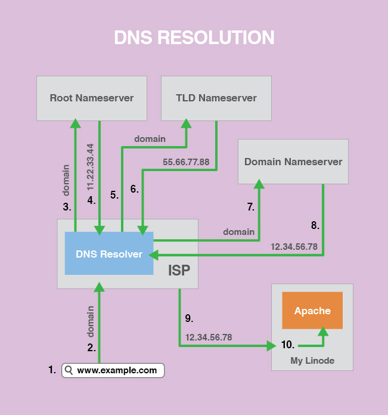

# 12 DNS (Domain Name System) Teknolojisine Giriş
### 1. DNS sisteminin çalışması

##### 1.1 Ağaç yapısı (tr -> org -> linux -> kamp)
    1. Yazısal adresi, sayısal adrese dönüştürür
    2. Sayısal adres için, yazısal adrese çevirir (Reverse DNS)
    3. Dns Exchanger Announce

- DNS sistemi ile bütünleşik çalışan bir sistem mevcuttur alan adları whois veri tabanı. abc.com alan adını satın alalım. Yazman servisi diyor ki, abc.com u internette bulundurabilmen için bunu aktif bir DNS sunucusunda bulundurmanız gerekir. Bu yüzden bir Hosting firmasından, alan adınızı barındırması için yer talep etmeniz gerekir. Para Ltd. ye gidip benim bir domainim var bunu barındırın lütfen diyorsunuz ve bizde barındırma hizmeti veriyoruz. Hosting firmasının yetkilisi, barındırma sunuculularımın adresi ns1.hede.net ve ns2.hede.net ana dns sunucu hizmetlerini gidip yazman servislerine kaydet, yani domain aldığınız yere bildir. Godaddy vs vs gidip, dns yönlendirmelerini yapyıyorum.

- Resolver mekanizması çalışır. Recursive sorgulama yapar. Her DNS'in bir cache'i var. Belli bir zaman hafızasında tutuyor. Kök sunucular (Root DNS Server) ip adresi öğreniliyor. O zamana kadar gezilen tüm sunucularda abc.com'un ip adresi her birinin cache belleğine yazılıyor.

- Bilgisayar (abc.vom) - ISP - Root Server - TLD (Top Level Domain Server) .com - Authorative Name Server -> abc.com = 22.11.33.44

- DNS Hiyerarşisi

       	- DNS Hiyerarşisi aşağıdaki katmanlardan oluşur.
        1) Root Level
        2) Top Level Domains
        3) Second Level Domains
        4) Sub-Domain
        5) Host

###### DNS Root Level

1) Kurumsal hiyerarşi :  com, .net, .org.
2) Coğrafi Hiyerarşi : .tr .de .uk, .fr, .pe.

Root DNS sunucuları 12 farklı kurum tarafından yönetilir.
1) Verisign
2) University of Southern California
3) Cogent
4) University of Maryland
5) NASA AMES Research Center
6) Internet Systems Consortium
7) US Department of Defense
8) US Army Research Lab
9) Netnod
10) RIPE
11) ICANN
12) WIDE

Kurumsal Hiyerarşi

    Domain        Tanımı
    com         : Ticari kurum
    edu         : Eğitim kurumları
    gov         : Devlet kurumları
    mil         : Ordu grupları
    net         : Geniş ağ destek merkezleri
    org         : Kar amacı gütmeyen kuruluşlar
    int         : International organizasyonlar

https://www.youtube.com/watch?v=2ZUxoi7YNgs

##### 1.2 Alan adı çözümleme (nsswitch, /etc/hosts, /etc/resolv.conf)

### 2. dig, nslookup, host

### 3. DNS kayıtlarının incelenmesi (A, MX, CNAME, NS, AAAA)

### 4. Birincil (master) ve ikincil (slave) DNS kavramı.
#### 4.1 Yetkili (authorative)
#### 4.2 Özyinelemeli (recursive) sorgu

### 5. SOA kaydı (TTL, Refresh, Retry, Expire, Minimum)